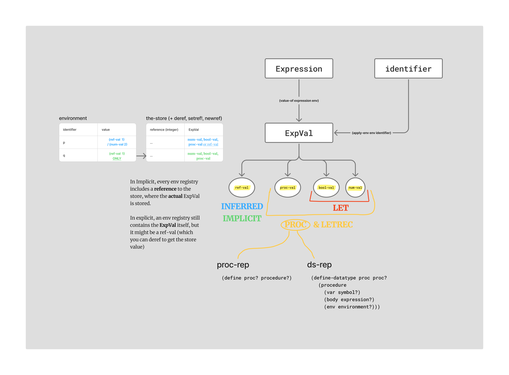

# Solutions for 'Programming Languages'

Solutions are grouped by language (PROC, IMPLICIT, LET, ...)
Solutions may be inaccurate or might have better implementation methods - but they surely are a nice example to give some ideas on how to solve these questions. 

In some occurences (only a few), I have grouped together a few exercises that can be implemented all at once - As far as I'm aware, the only occurence is within IMPLICIT/2019b-91 which ALSO contains solutions for: 
- 2020b-72
- 2020b-73

### Some exams are missing - either because I don't have them, or because I haven't solved them yet (they'll be uploaded once I do)
In general there's no record for any exam in 2022 (?) 

